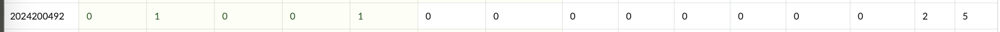
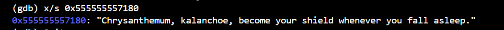
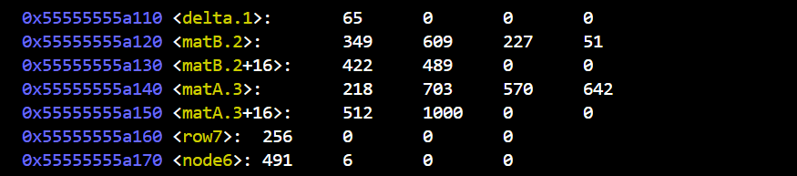
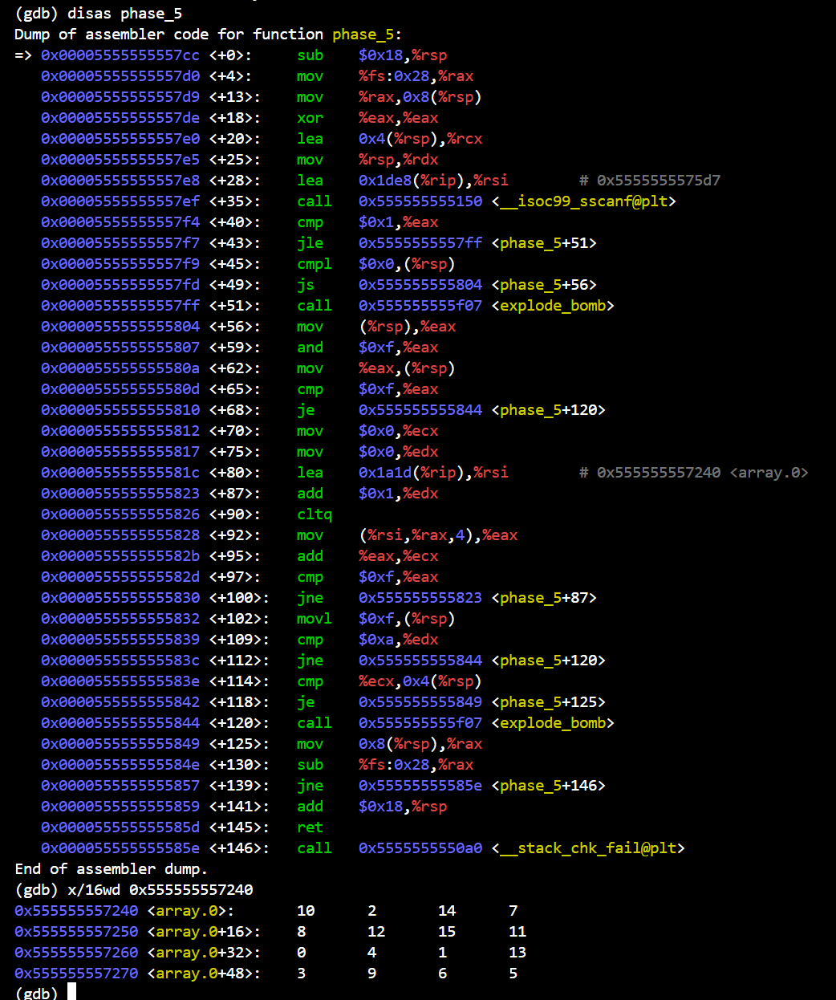
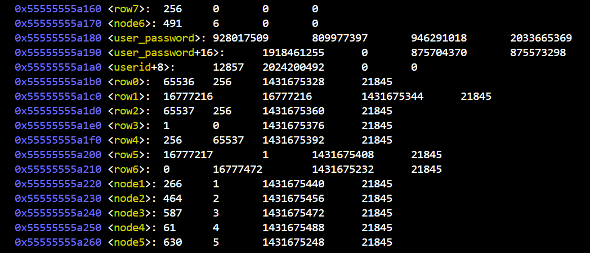

# bomblab 报告

姓名：李森

学号：2024200492

| 总分 | phase_1 | phase_2 | phase_3 | phase_4 | phase_5 | phase_6 | secret_phase |
| --------- | ------------- | ------------- | ------------- | ----------------- |-----------|-----------|-----------|
| 5        | 1            | 1            | 1            | 1 |1  |0  |0  |


scoreboard 截图：



<!-- TODO: 用一个scoreboard的截图，本地图片，放到 imgs 文件夹下，不要用这个 github，pandoc 解析可能有问题 -->

## 解题报告

<!-- 对你拆掉的每个phase进行分析，并写出你得出答案的历程 -->

<!-- 如果能用伪代码还原题目源代码最佳（不属于先前提到的大段代码），语言描述自己的分析也可，每道题目的图片不建议超过两张 -->

### phase_1

```c
// 附上题目答案
Chrysanthemum, kalanchoe, become your shield whenever you fall asleep.
```

在 phase_1 的汇编代码中，我观察到程序调用了 strings_not_equal 函数来比较字符串，说明这个的答案是一个字符串，然后就观察要比较0x3180处的字符串，我就先用反汇编找到地址，再在gdb中用x/s找到字符串,答案为Chrysanthemum, kalanchoe, become your shield whenever you fall asleep.，如图



### phase_2

```c
// 附上题目答案
476203 447345 762282 906090
```

对于 phase_2 ,先分析汇编代码，其中有一行是比较是否为四个📄，则证明这道题我需要输入四个整数。接着就要分析这四个整数是什么，我就回到代码，发现两个双层循环，意味着是两个二维数组，一个二行三列，另一个三行二列。然后观察对数据的处理，发现是乘法累加，则说明是一个矩阵乘法，又对应四个整数的输入答案，则是二行三列矩阵乘三行二列的矩阵，生成一个二阶矩阵。这是我需要找到两个矩阵十二个值，结果如图



找到了两个矩阵的十二个值，默认按行存储，就通过矩阵乘法公式挨个计算即可，结果为
476203 447345 762282 906090
（这个phase我计算错了导致炸掉一次好生气。。。第二次就是用了计算器，算对了）


### phase_3

```c
// 附上题目答案
0 731
1 17
2 93
3 495
4 1
5 137
6 570
7 596
```

对于 phase_3 ，先看汇编代码，出现了先判断一个数是否在0-7，说明是一个switch-case结构，第二个数是一个计算结果。我们接着找每个case的公式，得到eax = CONST - delta，然后反汇编找到delta.1的地址，再yong的值为65（上图中一起给出了）。我再根据
第一次输入的值找出CONST的值，对应的答案为
0 731
1 17
2 93
3 495
4 1
5 137
6 570
7 596

### phase_4

```c
// 附上题目答案
31 BC
```

这个phase依旧先看输入，发现依然是两个输入，又看到一个整数一个字符串，现在就要着手找着两个值。func4_1是一个递归函数，我们要找的第一个数就是func4_1（ 5 ），现在我解递推得到func4_1（ n ）= 2 ^ n - 1，则第一个数为31。现在来找这个字符串，分析func4_2的汇编代码发现，func4_2(n=5, k=18, src=A, dst=C, aux=B, out=buf)，那么我们要找的字符串，就是输出的buf，看出func4_2是一个汉诺塔，总步数为31，中间步则为16，推出输出值为BC，则答案为31 BC。

### phase_5

```c
// 附上题目答案
-3 69
```

依旧先看输入，还是两项，接着就看第一项，发现要求是一个负数！！！接着就要找这个数了，发现要求这个负数的低四位要在0-14之间。接着看第二项，第二项则是要对于循环路径上每一个数进行加和，这时我们要确定我们的第一个数了，循环要求步数为10的时候，首次出现15，那我们先找array如图



接着就是纯手工计算，一个一个进行试验，得出答案
-3 69

### phase_6

```c
// 附上题目答案
5 3 6 2 1 4
```

这个phase和secret_phase我都超时了，但是这个我解出来了。
依旧先看输入，这次要求输入六个整数，没个整数都要求在1-6之间，并且要求这六个数互不相同。再分析发现其实输入的值就是对应链表的节点，则新链表就由我的输入决定，还要求新链表需要从大到小.
接下来就找这六个节点，如图



则我的phase_6的答案应该为5 3 6 2 1 4

### secret_phase

```c
// 附上题目答案
（超时无法做出来这一道题）
```
这个phase本质是一个棋盘从起点走到终点，要求不能“撞墙”，现在我需要dump出来一个我的地图，但是我超时了，没有办法了。。。

## 反馈/收获/感悟/总结

<!-- 这一节，你可以简单描述你在这个 lab 上花费的时间/你认为的难度/你认为不合理的地方/你认为有趣的地方 -->

<!-- 或者是收获/感悟/总结 -->

<!-- 200 字以内，可以不写 -->

首先是学习gdb的使用，诸多问题我询问了同学与AI，协助我解决了gdb的使用问题。其次我最一开始解决问题很混乱，不知从什么地方开始，越做越有条理，先找输入，再根据输入的要求一步一步回到汇编代码来找我们要的值。

## 参考的重要资料

<!-- 有哪些文章/论文/PPT/课本对你的实现有重要启发或者帮助，或者是你直接引用了某个方法 -->
参考了课本上gdb使用方法
<!-- 请附上文章标题和可访问的网页路径 -->
